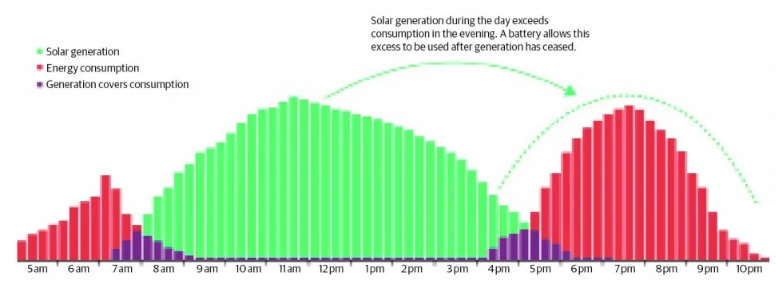
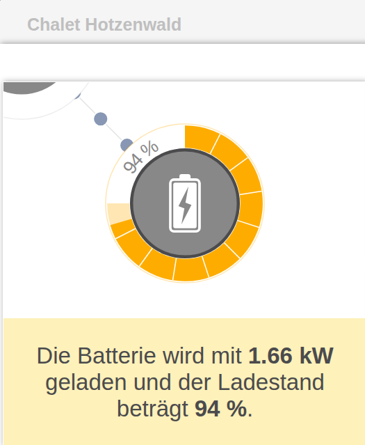
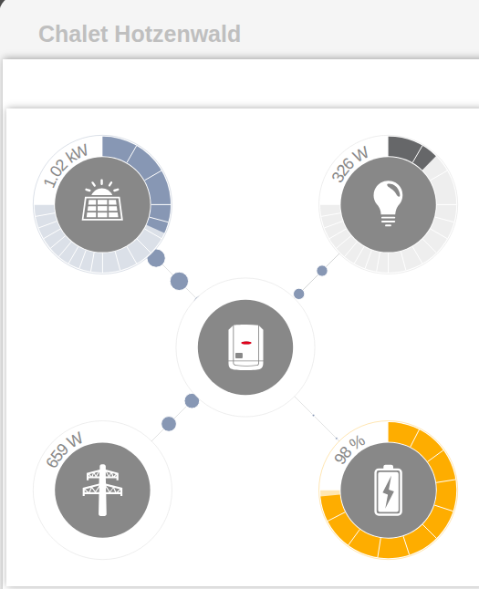
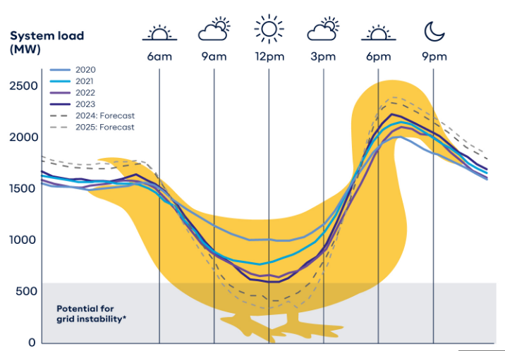
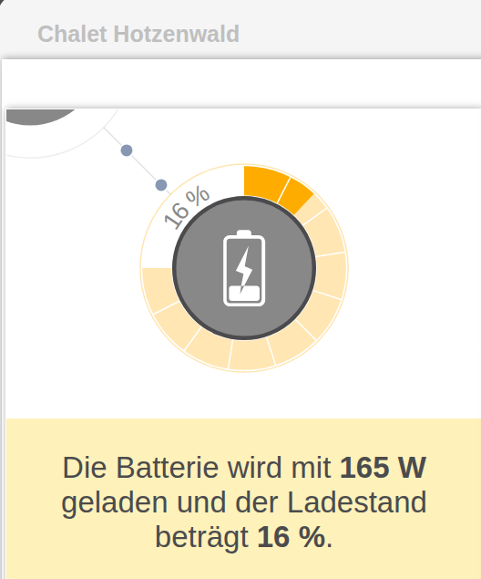

# Fronius_Symo_Sony
run a 10yrs old Fronius Symo hybrid inverter and sony battery grid friendly.

This is the setup we are talking about:


## purpose

usually the solar generation does not fit the energy consuption. That's why we use batteries. Unfortunatelly the batteries are charged with first power delivered from sun, are fully charged at 11am and exactly if energy consumption is low, our solar panels deliver to the grid. This can be modified if we first deliver sun gains to the grid and charge batteries if energy consumption in the grid is low. 

So let's reduce the charging rate for batteries in the early morning and increase charging rate at noon. Then, depending on sun hours, we deliver to the grid in the morning, our battery will be fully charged at 4pm and we deliver solar power if energy consuption is increasing.



- [x] flatten the duck-curve
- [x] reduce charge rate if battery nearly full
- [x] stops charging at SoC 98% 

## Features
 - [x] easy to use small python scripts
 - [x] made for crontab
 - [x] support parameter / args

## Installation

copy the python *.py files in your folder
modify your presets and IP-adress of your Fronius inverter
```python
battlow=10      # Untergrenze SoC min
chargerate=100    # in Prozent von 3328W, 0 ist aus, 100 ist max
deliverrate=100 # in Prozent von 3328W, 0 ist aus, 100 ist max
battmode=3      # 1 charge-limit, 2 discharge-limit, 3 both limits

device = ModbusTcpClient(host = "172.16.0.171", port = 502, timeout=1) # Adjust as needed
```

FroniusBatterie_full.py modify values for charging slower and stop charging at target-SoC here:

```python
if soc >= 98: 
    chargerate=0  # set to zero to stop charging
elif soc >= 90:
    chargerate=20 # charge very slow
elif soc >= 80:
    chargerate=50 # reduce charge rate
else:
    chargerate=100 # allow full chargerate 
```

## Usage
### fill battery slowly 

call the python script to slowly charge your battery from 80% to 98% from i.e. noon til 5pm every 2 minutes



```sh
# m h  dom mon dow   command
# Batterie vom Fronius im Chalet sanft voll-laden:
*/2 12-17 * * * /usr/bin/python3 /home/peterf/python-scripte/modbus/FroniusBatterie_full.py &>/dev/null
```

### flatten duck-curve

call the script to avoid the duck-curve at 8 in the morning til noon. Check proper hours for your location and your  amount of storage.
as i'm calling it having chargerate 5%, it still charges the battery with 3.328W * 0.05 at around 165W. 
All Watts deliverd from PV above 165W are fed into the grid.





```sh
# Batterie vom Fronius netzdienlich betreiben, morgens erstmal einspeisen, nicht laden. 2.Parameter Chargerate 5%
0 7 * * *  /usr/bin/python3 /home/peterf/python-scripte/modbus/FroniusBatterie.py 10 5 100 3
# Batterie vom Fronius netzdienlich betreiben, mittags im Peak dann aufladen statt einspeisen, Chargerate 100%
0 12 * * *  /usr/bin/python3 /home/peterf/python-scripte/modbus/FroniusBatterie.py 10 100 100 3
```
### forced charging from grid in cheap hours

expecting thunderstorms and other reason for outage prepare filling up your battery. 
Or, using dynamic prices for your energy, like aWATTar or tibber, you may call Fronius_minSoC.py for a few hours with parameter 90
this will charge your battery from grid upto 90% SoC. At ending of cheap hours call it with parameter 10 to allow discharging of battery

```sh
# Batterie vom Fronius im Chalet zwangsladen:
0 02 * * * /usr/bin/python3 /home/peterf/python-scripte/modbus/Fronius_minSoC.py 90 &>/dev/null
0 05 * * * /usr/bin/python3 /home/peterf/python-scripte/modbus/Fronius_minSoC.py 10 &>/dev/null
```

## Authors

[Peter F. aus H.](https://github.com/PeterFausH)

BlueSky: [Peter F. aus H.](https://bsky.app/profile/alpensichtung.bsky.social)

Blog in german: https://www.NC-X.com

email pf@nc-x.com


## License

[MIT](https://tldrlegal.com/license/mit-license)

[fronius-logo-url]: https://upload.wikimedia.org/wikipedia/commons/2/2e/Fronius-logo.png
